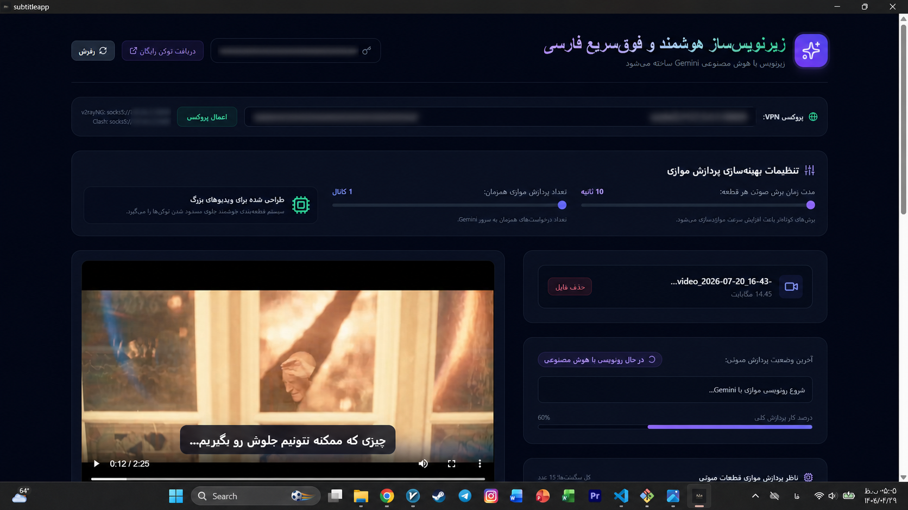
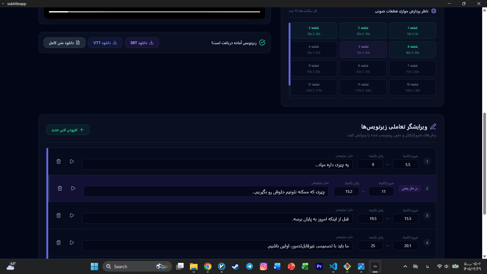

<p align="center">
  
</p>

# Aria 🎬
### AI‑Powered Persian Subtitle Generator

Aria is a desktop application that automatically generates high‑quality Persian subtitles using Google Gemini AI.

---

## ✨ Features
- 🎥 Video upload
- 🧠 AI-powered transcription
- ⚡ Parallel processing
- 📄 Export as SRT / VTT / TXT
- ✅ Clean and modern UI

---

## 📸 Screenshots

<p align="center">
  
</p>

<p align="center">
  
</p>

---

## 🛠 Tech Stack
- Electron
- React (Vite)
- Tailwind CSS
- Google Gemini API

---

## 🔐 Configuration (Gemini API Key)

Create a `.env` file in the project root (do NOT commit it to GitHub):

```env
GEMINI_API_KEY=YOUR_API_KEY_HERE
Tip: You can also create a .env.example file for others.

🚀 Installation
Bash

npm install
npm run dev
```

Built with ❤️ by Aria Rezvani
